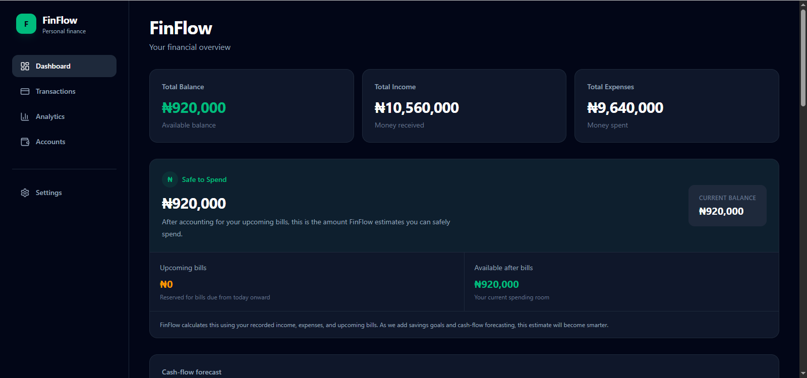
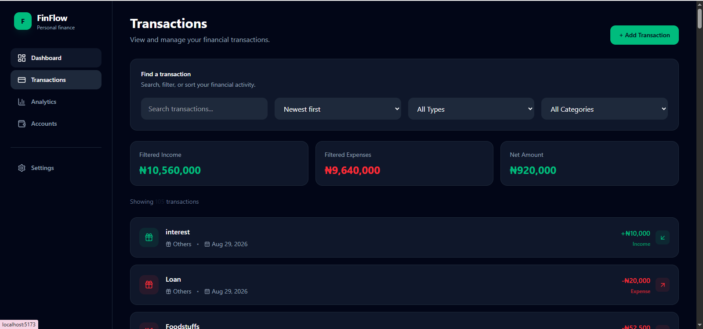
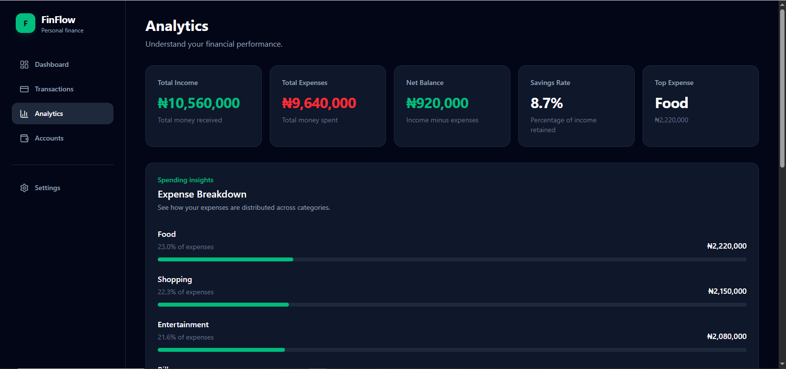
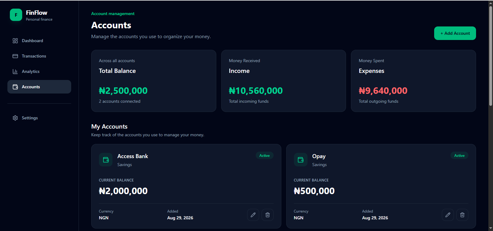
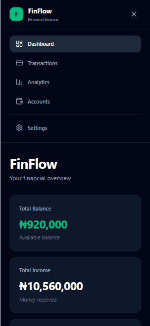
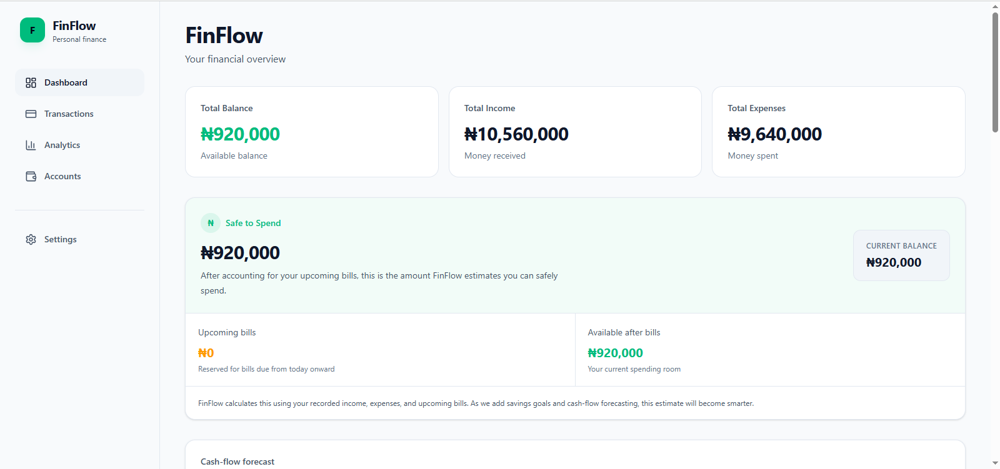

# FinFlow 💰

### A modern personal finance dashboard built with React, TypeScript, and Tailwind CSS.

FinFlow is a personal finance management dashboard designed to help users understand and manage their financial activity through accounts, transactions, bills, analytics, insights, and financial forecasting.

The project focuses on building a realistic frontend application with reusable components, structured application state, API integration, data visualization, responsive layouts, and type-safe development.

---

## 📸 Screenshots

### Dashboard



### Transactions



### Analytics



### Account Management



### Responsive Design



### Light Mode



---

## ✨ Features

### 📊 Financial Dashboard

- Overview of financial activity
- Income and expense summaries
- Financial status indicators
- Spending insights
- Safe-to-spend information
- Cash flow forecasting

### 💳 Transaction Management

- View transactions
- Add transactions
- View transaction details
- Organize transaction data
- Transaction-based financial summaries

### 🏦 Account Management

- View financial accounts
- Add new accounts
- Edit account information
- View individual account details
- Manage account-related data

### 📅 Bills & Recurring Expenses

- Track bills
- Manage recurring expenses
- Monitor upcoming financial obligations

### 📈 Analytics & Insights

- Financial charts and visualizations
- Spending breakdowns
- Financial insights
- Cash flow analysis
- Forecasting

### ⚙️ User Preferences

- Application settings
- Theme preferences
- Responsive navigation
- Mobile-friendly interface

---

## 🛠️ Tech Stack

### Frontend

- **React 19**
- **TypeScript**
- **Tailwind CSS**
- **React Router**
- **Recharts**
- **Lucide React**

### Data & API

- **Axios**
- REST API integration
- Data transformation utilities

### Development Tools

- **Vite**
- **ESLint**
- **Git**
- **GitHub**

---

## 🏗️ Project Structure

```text
src/
├── api/
│   ├── client.ts
│   ├── posts.ts
│   ├── transactions.ts
│   └── transformers.ts
│
├── components/
│   ├── CashFlowForecast.tsx
│   ├── FinancialChart.tsx
│   ├── FinancialInsights.tsx
│   ├── FinancialSummary.tsx
│   ├── Header.tsx
│   ├── MobileNav.tsx
│   ├── RecurringExpenses.tsx
│   ├── SafeToSpendCard.tsx
│   ├── Sidebar.tsx
│   ├── SpendingInsights.tsx
│   ├── SummaryCards.tsx
│   ├── TransactionItem.tsx
│   └── TransactionList.tsx
│
├── context/
│   ├── AccountsContext.tsx
│   ├── BillsContext.tsx
│   ├── PreferencesContext.tsx
│   ├── ThemeContext.tsx
│   ├── TransactionsContext.tsx
│   └── TransactionsProvider.tsx
│
├── pages/
│   ├── AccountDetails.tsx
│   ├── Accounts.tsx
│   ├── AddAccount.tsx
│   ├── AddTransaction.tsx
│   ├── Analytics.tsx
│   ├── Bills.tsx
│   ├── Dashboard.tsx
│   ├── EditAccount.tsx
│   ├── Settings.tsx
│   ├── TransactionDetails.tsx
│   └── Transactions.tsx
│
├── types/
│   ├── account.ts
│   ├── api.ts
│   ├── bill.ts
│   └── transaction.ts
│
└── utils/
    ├── cashFlow.ts
    ├── chart.ts
    ├── currency.ts
    ├── expenseBreakdown.ts
    ├── financial.ts
    ├── financialStatus.ts
    ├── forecast.ts
    ├── insights.ts
    ├── recurring.ts
    ├── safeToSpend.ts
    └── transactions.ts

    ---

## 🚀 Getting Started

### Clone the repository

git clone https://github.com/Kings06/finflow.git
cd finflow

### Install dependencies

npm install

### Start development server

npm run dev

### Build for production

npm run build

### Run lint

npm run lint

---

## 📱 Responsive Design

FinFlow is designed to work across desktop and mobile screen sizes, with layouts adapting to smaller screens.

The application includes responsive navigation and mobile-friendly layouts while maintaining the same core financial functionality across screen sizes.

---

## 🌙 Dark & Light Mode

FinFlow supports both dark and light themes, allowing users to switch between visual modes based on their preference.

---

## 🎯 What I Built

FinFlow was built as a practical frontend project focused on applying modern frontend development concepts to a realistic financial application.

Key areas explored include:

- Component-based architecture
- Type-safe development with TypeScript
- Application state management with React Context
- Reusable UI components
- REST API integration
- Data transformation
- Financial calculations
- Data visualization
- Responsive design
- Dark and light themes
- Client-side routing

---

## 📌 Project Status

Active development.

FinFlow is currently a frontend-focused project.

Future improvements may include:

- Backend persistence
- User authentication
- Database integration
- Real financial account integrations
- Additional financial analytics
- More advanced financial forecasting

---

## 👨🏽‍💻 Author

Ebuka Kings

Frontend Developer focused on building modern, responsive web applications with React, TypeScript, and JavaScript.

Portfolio: https://devbykings-portfolio.vercel.app
LinkedIn: https://linkedin.com/in/ebuka-kings
GitHub: https://github.com/Kings06